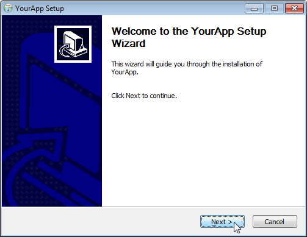
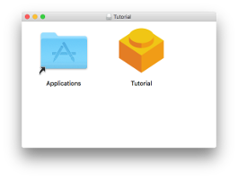
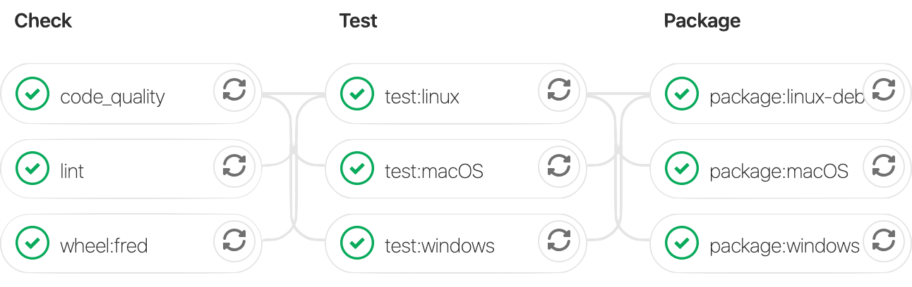

## Who Am I

<section style="text-align: left;">

<div class="a">Ogi Moore</div>

<a href="#" class="fa fa-twitter"></a> @ogimoore

<i class="fa fa-github" aria-hidden="true"></i>github.com/j9ac9k

<div class="a">Technologist @ Sensory</div>
</section>

<aside class="notes">
- Write software to improve QoL for other researchers and linguists
</aside>

# What are we talking about?

How can we distribute our python GUI applications to a widespread audience...

## Difference between a library and an application

my own definitions, and I am not an authority on this matter...

. . .

"library" is meant to be used by other developers

  * NumPy, requests, etc..

. . .

"application" is meant to be used by end-users

  * youtube-dl, spyder, qutebrowser...

## Libraries should be packaged for developers

1. Create python wheel with setuptools (or flit)
2. Upload to pypi, and then anyone can install via pip

```
pip install <library>
```

## Applications need to be distributed differently

::: incremental

* users may or may not have python installed
  * if they don't the last thing you want to maintain is a set of instructions that universally apply for setting up a python environment on each OS
* users may not feel comfortable interacting with the command line
* you may use a dependency that is not on PyPI

:::

# How do we make a GUI application?

::: incremental

Qt (pronunced "cute", not "cue-tea")

:::

- cross-platform framework to create modern and native looking GUIs
- considered most full-featured, powerful option available for python users
- alternatives like tkinter, wxPython, and kivy exist, and in some cases may be preferred
  - realistically most "alternatives" are effetively web services

## Little more on Qt

::: incremental

- C++ framework with python bindings available (PySide2, PyQt5)
  - best to abstract differences away by using `qtpy` library
- it's a _huge_ framework
- great add ons
  - pyqtgraph
  - pytest-qt

:::

::: notes

discuss interface w/ hardware (QAudio), SQL (QSql), OS-integration, network communication objects

:::

## Screenshot


# How should we deploy a GUI App?

- Make it into a wheel and upload to PyPI? 
  - Does not address the problems listed earlier...end users may not be developers

::: incremental

- can we create a "native" installer like any other application we install on our machines?

:::

## Something like this would be nice

:::::::::::::: {.columns}
::: {.column width="70%"}

:::
::: {.column width="30%"}

:::
::::::::::::::

## Sure we can!

. . .

but it's tricky...

## The fbs library

* with fbs, we can create native installers
* generate executables can be launched like any other application you install
* has awesome `fbs startproject` command to create a bare minimum example that you can modify for your project

## fbs does have requirements...

::: incremental

* needs to be a `PyQt5`/`PySide2` application
* project must have specific directory structure
* `base.json` to define project parameters
* `requirements/base.txt`to define dependencies
  * in my CI process I just run

     ```
     cp requirements.txt requirements/base.txt
     ``` 

* docs are _very_ good, source code is easy to read too...

:::

## How to use fbs?

::: incremental

- `fbs freeze` - Converts your python package into a stand-alone executable (via pyinstaller)
- `fbs installer` - Bundles your executable into a single file installer 
  - AppSetup.exe for Windows (using `NSIS`)
  - App.dmg for macOS (using `create-dmg`)
    - `create-dmg` is bundled with `fbs`
  - App.deb for Ubuntu/Debian (using `fpm`)

:::

## More considerations

- Windows installers can only be created on windows machines
  - same with macOS and linux 
- Ubuntu needs a `fpm` to make the .deb packages
- Windows needs `pypiwin32`, Windows10 SDK, Visual C++ redistributables and `NSIS`
- Really annoying to setup a bunch of VMs and do manually

## Runs from source != executable will run

::: incremental

- Executable creation may not capture your dependencies correctly, or something else can go wrong
  - with NumPy 1.17.0 pyinstaller did not grab `numpy.random.common`
  - SciPy 1.3.1 → 1.3.2+ had Windows based .dll's relocated, pyinstaller did not grab them
  - app referencing the current git commit hash
  - writing a log file to the project main directory 

:::

::: notes

pin your dependency versions so you can go in your git history and evaluate what dependency update broke things

:::

## Testing the Executable

- Start the application wait 10 seconds, kill it by name
  - If you get an error when killing the application, it means it didn't start successfully, and you need to investigate more
  - If it kills without an error code, it means your application was running 👍
  - Trickier on windows, need to make into non-windowed executable first, test, then make into windowed executable

## How to test executables

```
# Linux
target/App/App & sleep 10 ; kill $!

# macOS
(target/App.app/Contents/MacOS/App) & sleep 10 ; kill $!

# Windows
start target\App\App.exe & waitfor timeVoid /t 10 2>NUL & taskkill /im App.exe /f
```

## CI to the rescue
- Many CI services free for open source projects
  - azure pipelines
  - travis
  - github actions
- make installers artifacts


::: notes

make sure to ask the auddience how many are familiar with CI systems in general...

:::

# Demo Fred

# Bonus - Code-Signing
- code-sign your application to skip scary warnings when installing
  - isn't free...

# Wrap up

::: incremental

- Qt framework is amazing, if you need to make a GUI application, and want to use python, it is a fantastic way to go
- `fbs` can bundle your GUI application into an installable package by leveraging pyinstaller and other dependencies
- process is _very_ fragile, care must be taken to ensure your application was bundled successfully
- pin your runtime dependencies
- use a CI service, this is really a pain to do manually

:::

::: notes

fbs is effectively a convinience wrapper, depending on what you are doing, you may be able to remove it and do things manually yourself

:::

# Future Work

- Create a cookie cutter template that generates the right directory strcture and does simple CI configs from the get go

# References

- macOS walkthrough - https://git.io/JeAfJ
- fbs
  - https://build-system.fman.io/
  - https://github.com/mherrmann/fbs
- pyinstaller - https://www.pyinstaller.org/
- Qt - https://doc.qt.io/qt-5/
- qtpy - https://github.com/spyder-ide/qtpy


# Content Created Using

- reveal.js - javascript library used to show presentation
- pandoc - contents started off as markdown, used pandoc to convert to revealjs
- fontawesome - for some icons
- sublimetext - editor I decided to use